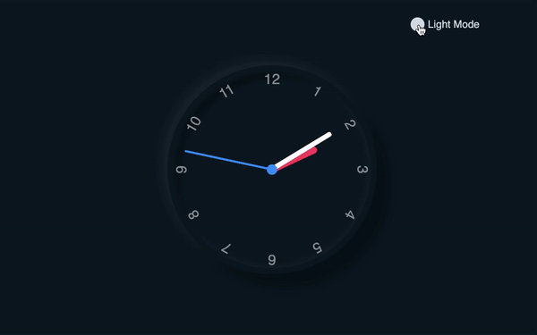

# CSS_Neumorphism_Working_Analog_Clock_Toggle_Between_Dark/Light_Mode
In this project I will be covering CSS position, and transform extensively. I will also use CSS variables to make the JavaScript integration much easier. By the end of this we will have a fully functional clock and more importantly increased our CSS and JavaScript skills significantly.

# Concepts Covered:
- CSS variables in JavaScript
- JavaScript date object
- CSS transform to center elements
- CSS transform to rotate elements on an axis
- Using data attributes as selectors in JavaScript
- Basic CSS pseudo element usage
- Toogle

# Visuals

# Find me:
📲Instagram: @selcodeniac
